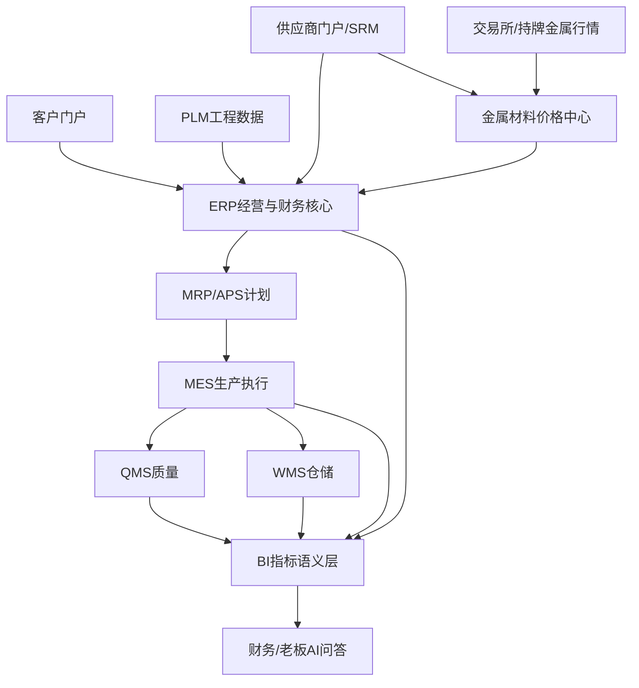

# 系统上下文与集成边界

## 上下文

## 系统职责

- ERP 是经营交易、库存价值、应收应付、成本和财务凭证的权威来源。
- PLM 是图纸、BOM、工艺和工程版本的权威来源。
- MES/QMS/WMS 分别控制生产、质量和仓储现场过程，结果回写 ERP。
- 金属价格中心保存外部行情、企业价格规则和业务快照，不替代采购订单或法定存货账。
- BI/语义层统一指标；AI 只通过受控分析接口访问，不形成独立事实库。

## 集成原则

1. 业务对象使用稳定唯一键，不使用名称作为接口主键。
2. 消息包含事件编号、对象版本、发生时间、来源和关联追踪编号。
3. 接口具备幂等、重试、错误队列、补传、监控和业务对账。
4. 主数据发布与交易事件分离；历史版本不能被当前数据覆盖。
5. 外部门户和 AI 权限在数据服务层强制执行。
6. 金额、数量、币种、单位、时区和税口径在接口契约中显式定义。

## 待 ADR 决策

- 采购成熟 ERP 组合还是自研核心；
- 模块化单体与服务拆分的边界；
- 身份提供商和外部用户体系；
- 主数据库、分析平台和消息/任务机制；
- 云、私有化或混合部署；
- 行情数据商、许可和缓存策略；
- AI 模型部署、数据驻留和知识库方案。
