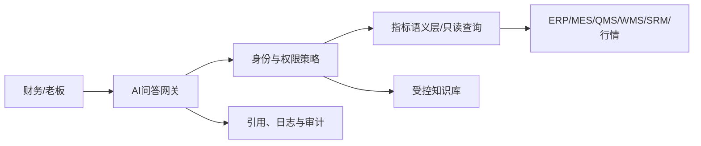

# 财务与老板 AI 分析问答

## 定位

AI 是受权限控制的分析入口，不是第二套账、第二套指标或自动审批机器人。它只能通过指标语义层、只读查询服务和受控知识库访问数据。

## 财务场景

- 应收账龄、逾期客户、承诺回款和催收优先级；
- 未来 7/30/90 天收付款、资金缺口和付款排序建议；
- 报价、标准和实际成本差异；
- 客户、产品、订单和业务员毛利变化；
- 月结任务、未过账单据、负库存、暂估和对账差异；
- 发票、税务、预算、费用和资产异常；
- 金属价格变化对采购、库存、在制、成本、毛利和现金的模拟影响。

## 老板场景

- 订单、销售、回款、毛利、现金、库存、在制、交付、质量和设备总览；
- 与预算、目标、上期和去年同期比较；
- 从指标异常追问到客户、产品、订单、工序、供应商和凭证；
- 交付、现金、客户信用、供应商和材料价格风险；
- 材料涨价、汇率、插单、停机和回款延迟的情景模拟。

## 答案契约

每个答案必须提供：

- 数据截止时间；
- 组织、期间、币种、含税/未税和筛选条件；
- 指标定义和计算逻辑；
- 来源系统、报表、凭证、单据或行情快照引用；
- 已验证事实、推断、预测和建议的清晰区分；
- 数据缺口、异常或不确定性；
- 对话和导出审计编号。

## 权限与执行

- 查询执行层再次校验组织、行和字段权限，不能只依赖提示词。
- 工资、银行、个人信息、成本、供应商底价和其他组织数据按角色隔离。
- AI 默认只读，不能直接记账、付款、关账、审批、质量放行、改订单或发送外部文件。
- 未来写回只能生成草稿，用户二次确认后走原业务审批。
- 企业数据和对话不得未经批准用于外部模型训练。

## 技术边界

模型不持有生产数据库写账号。结构化查询、参数、返回数据、引用和回答共享追踪编号，以便重放和核对。

## 验收

- 固定问题集与正式报表数字和口径一致；
- 连续追问保持组织、期间和币种上下文；
- 点击引用能到达授权报表、凭证、单据或行情快照；
- 缺失数据时明确说明且不编造；
- 使用低权限账号进行越权、提示注入和敏感字段测试；
- 模型不可用时标准报表和驾驶舱仍能工作。
